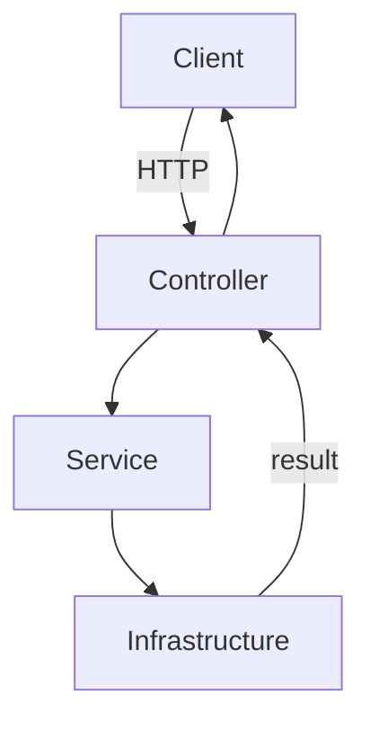
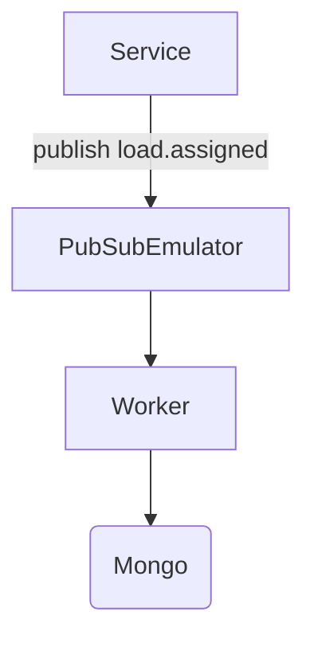

# 🚚 Billor Backend Challenge — Driver & Load Management API

A production-ready **NestJS** backend for managing drivers, loads, and assignments with **Postgres**, **Redis**, **MongoDB**, and **Google Cloud Pub/Sub**.

---

## 🏗️ Architecture

This project follows a domain-oriented, modular architecture with clear separation of concerns. Below is a condensed overview; you can also read the in-depth version in [ARCHITECTURE.md](./ARCHITECTURE.md).

### 📁 Project Structure
```
src/
├── common/                    # Cross-cutting concerns (decorators, guards)
├── config/                    # Environment validation
├── core/                      # Business logic (domain layer)
│   ├── assignments/
│   ├── drivers/
│   ├── loads/
│   └── users/
├── infrastructure/            # Adapters for external services
│   ├── audit/                 # MongoDB audit
│   ├── cache/                 # Redis cache
│   ├── database/              # Prisma & Postgres
│   └── messaging/             # Pub/Sub publisher & worker
├── modules/
│   └── auth/                  # JWT authentication
├── app.module.ts              # Root module
└── main.ts                    # Application entry point
```

---

## 🚀 Quick Start

### 1️⃣ Infrastructure (Docker)
```bash
yarn infra:up
```

### 2️⃣ Configuration
```bash
cp .env.example .env
```
Adjust variables according to [ENVIRONMENT.md](./ENVIRONMENT.md)

### 3️⃣ Dependencies & Prisma
```bash
yarn install
yarn prisma:generate
yarn prisma:migrate:dev
yarn seed
```

### 4️⃣ Run Application & Worker
- **API**: `yarn dev` → [http://localhost:3000](http://localhost:3000)
- **Worker**: `yarn worker`

### 5️⃣ API Documentation (Swagger)
- Access [http://localhost:3000/api/docs](http://localhost:3000/api/docs)
- Login at `/api/auth/login` and use the Bearer token

### 6️⃣ Testing
- **Unit tests**: `yarn test`
- **Lint/Format**: `yarn lint`, `yarn format`
- **Endpoint scripts**: 
  - Bash: [`scripts/test_endpoints.sh`](./scripts/test_endpoints.sh)
  - PowerShell: [`scripts/test_endpoints.ps1`](./scripts/test_endpoints.ps1)

### 7️⃣ Shutdown Infrastructure
```bash
yarn infra:down
```

---

## 📚 Documentation

- **[BILLOR_CHALLENGE.md](./BILLOR_CHALLENGE.md)** — Complete challenge scope, requirements, and solution mapping
- **[ARCHITECTURE.md](./ARCHITECTURE.md)** — Detailed architecture, layers, flows, and design decisions
- **[ENVIRONMENT.md](./ENVIRONMENT.md)** — Required environment variables and configuration guide
- **Swagger** — [http://localhost:3000/api/docs](http://localhost:3000/api/docs)
- **Prisma Schema** — [`prisma/schema.prisma`](./prisma/schema.prisma)
- **Worker (Pub/Sub)** — [`src/infrastructure/messaging/main.ts`](./src/infrastructure/messaging/main.ts)

### 🔷 Architectural Layers
- **Common (`src/common/`)**: Shared decorators and guards
- **Core (`src/core/`)**: Domain rules, services, DTOs, and controllers per bounded context
- **Infrastructure (`src/infrastructure/`)**: Technical integrations (DB, cache, messaging, audit)
- **Feature (`src/modules/auth/`)**: Authentication and JWT strategy

### 🔄 Data Flow (API)


### 📡 Event Flow (Pub/Sub)


### 🔗 Module Dependencies
```
Core
  assignments → database, cache, messaging, audit
  drivers     → database
  loads       → database, cache
  users       → database

Infrastructure
  database    → Prisma Client (Postgres)
  cache       → Redis (ioredis)
  messaging   → Google Pub/Sub (emulator)
  audit       → MongoDB

Feature
  auth        → JWT
```

### 🔒 Security
- JWT authentication for all routes (except `/auth/login`)
- `JwtStrategy` injects user into `request.user`
- Guards applied on controllers (`@UseGuards(JwtAuthGuard)`)

### 🚀 Deployment & Operability
- Horizontally scalable (API and Worker are independent)
- Cache reduces database load
- Configuration via `.env` (see `ENVIRONMENT.md`)

### 🧪 Testing Strategy
- Unit tests for core services and messaging
- E2E spec (`test/app.e2e-spec.ts`)
- Endpoint scripts: `scripts/test_endpoints.sh` (Bash) and `scripts/test_endpoints.ps1` (PowerShell)

For more details, see [ARCHITECTURE.md](./ARCHITECTURE.md).

---

## ⚡ Quickstart (Challenge)

```bash
# 1. Start infrastructure (Docker required)
npm run infra:up

# 2. Setup and run (in a new terminal)
cp .env.example .env && npm install && npm run prisma:generate && npm run prisma:migrate:dev && npm run seed && npm run dev
```

---

## 🔌 API Endpoints

### Authentication
- **`POST /auth/login`** → `{ access_token }`

### Resources
- **`POST /users`** — Create user
- **`POST /drivers`** — Create driver
- **`POST /loads`** — Create load
- **`GET /loads`** — List loads (cached 60s via Redis; invalidated on create/update)
- **`GET /loads/:id/events`** — Relational events timeline (Postgres `LoadEvent`)

### Assignments
- **`POST /assignments`** → `{ driverId, loadId }`
  - Enforces one active assignment per driver
  - Publishes `load.assigned` event (Pub/Sub)
- **`GET /assignments/:id`** — Get assignment details
- **`PATCH /assignments/:id/status`** → `{ status: COMPLETED | CANCELLED }`
  - Writes relational event (`LOAD_COMPLETED` | `ASSIGNMENT_CANCELLED`)
  - Writes NoSQL audit event (MongoDB)

---

## 📊 Events & Auditing

### Relational Events (Postgres)
Table `LoadEvent` tracks the complete lifecycle:
- **`LOAD_CREATED`** — On load creation
- **`ASSIGNED`** — On assignment creation
- **`LOAD_COMPLETED`** / **`ASSIGNMENT_CANCELLED`** — On status update

### NoSQL Audit (MongoDB)
Audits for Pub/Sub consumer and status updates:
```json
{ "loadId": "...", "type": "...", "payload": {...}, "timestamp": "..." }
```

---

## 🔧 Worker (Pub/Sub)

- **Publisher**: On assignment creation, publishes to topic `load.assigned`
- **Worker**: `yarn worker` subscribes and writes audit to MongoDB
- **Emulator**: Runs from docker-compose; no gcloud local install needed

---

## 🧪 Test Script

### Bash: `scripts/test_endpoints.sh`
Expects API at `http://localhost:3000/api` (or set `BASE_URL`)

**Test Flow:**
1. Login and get JWT
2. Create user, drivers, loads
3. Validate cache on `GET /loads`
4. Create assignment (publishes event)
5. Fetch assignment details
6. Ensure second assignment for same driver fails
7. Complete assignment and verify
8. Validate relational events timeline: `LOAD_CREATED`, `ASSIGNED`, `LOAD_COMPLETED`

---

## 💻 Development Notes

- **Database**: Postgres (Prisma) — Run `yarn prisma:generate && yarn prisma:migrate:dev` after schema changes
- **Cache**: Redis via `@nestjs/cache-manager` + `cache-manager-ioredis-yet`
- **NoSQL**: MongoDB (audits) — Configure via `.env`
- **Pub/Sub**: Google Pub/Sub Emulator in Docker — Configure via `.env`
- **Auth**: JWT guard required for all routes except `/auth/login`

---

## 🎯 Billor Challenge

Full challenge description, decisions, and how the implementation maps to the requirements are documented in **[BILLOR_CHALLENGE.md](./BILLOR_CHALLENGE.md)**.

---

## 🗺️ Roadmap: Next Entities and Improvements

### 🎯 Suggested Short-Term Priorities
1. **Vehicles** — CRUD with relation to `Driver`. Validate vehicle capacity/type when creating an `Assignment`
2. **Customers/Carriers** — CRUD and relation on `Load.customerId`
3. **Driver Availability** — Availability windows; check during `Assignment` creation
4. **Routes** — Frequent routes with `distanceKm`/`slaHours`; optional `Load.routeId`
5. **Load Documents** — Upload metadata (MongoDB) linked to `Load/Assignment`

### 🆕 New Entities (Options)

#### 🚗 Vehicles
- **Prisma**: `Vehicle { id, plate unique, type, capacityKg, driverId? }` (+ index by `plate`)
- **API**: `src/core/vehicles/` (module, service, controller, DTOs)
- **Endpoints**: `POST/GET/PATCH/DELETE /vehicles`
- **Rules**: Validate compatibility (weight/type) prior to `Assignment`

#### 🏢 Customers/Carriers
- **Prisma**: `Customer { id, name, taxId unique }`; add `customerId` to `Load`
- **API**: `src/core/customers/` + load filters by customer

#### 🛣️ Routes
- **Prisma**: `Route { id, origin, destination, distanceKm, slaHours }`; optional `Load.routeId`

#### 📅 Driver Availability
- **Prisma**: `DriverAvailability { id, driverId, startAt, endAt }`
- **Rule**: Consider availability on `Assignment` creation

#### 📄 Load Documents/Proofs
- **MongoDB**: Metadata collection; `documents/` module (external file storage, keep metadata and links only)

### 🔧 Other Improvements

#### 🔄 Messaging Resilience
- Retries/backoff, DLQ (alternate topic), idempotent consumer

#### ⚡ Caching
- Confirm TTLs, fine-grained invalidation in `loads`/`assignments`, versioned cache keys

#### 🔐 Security
- `argon2` for passwords, JWT expiration/rotation; optional refresh tokens

#### 📈 Observability
- Structured logging (pino), `request-id` correlation, timing/metrics interceptors

#### 📖 Swagger
- DTO examples, context tags, error schemas, global `BearerAuth`

#### 💚 Health/Readiness
- Endpoints and container healthchecks for API and Worker

#### 🔄 Data/Transactions
- Transactional `Assignment` creation (enforce one active per driver), idempotency

#### 🚀 CI/CD
- GitHub Actions (lint/test/build/prisma generate), multi-stage Dockerfile, compose override

#### 🛠️ Developer Experience
- `husky` + `lint-staged`, cross-platform `env:validate`, polished README quickstart

---

**Built with ❤️ using NestJS, Prisma, Redis, MongoDB, and Google Cloud Pub/Sub**
