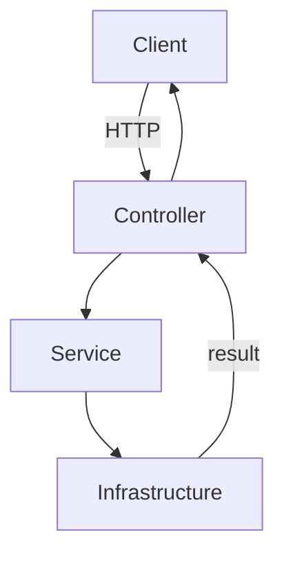
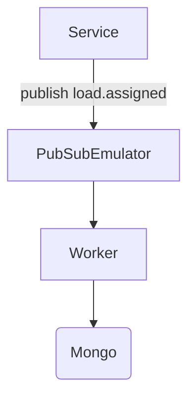

# Billor Backend Challenge — Driver & Load Management API

A production-ready **NestJS** backend for managing drivers, loads, and assignments with **Postgres**, **Redis**, **MongoDB**, and **Google Cloud Pub/Sub**.

## Architecture

This project follows a domain-oriented, modular architecture with clear separation of concerns. Below is a condensed overview; you can also read the in-depth version in [ARCHITECTURE.md](./ARCHITECTURE.md).

### Project structure
```
src/
├── common/                    # Cross-cutting concerns (decorators, guards)
├── config/                    # Env validation
├── core/                      # Business logic (domain layer)
│   ├── assignments/
│   ├── drivers/
│   ├── loads/
│   └── users/
├── infrastructure/            # Adapters for external services
│   ├── audit/                 # MongoDB audit
│   ├── cache/                 # Redis cache
│   ├── database/              # Prisma & Postgres
│   └── messaging/             # Pub/Sub publisher & worker
├── modules/
│   └── auth/                  # JWT auth
├── app.module.ts              # Root module
└── main.ts                    # App entry point
```

## Step-by-step

1) Infraestrutura (Docker)
   - `yarn infra:up`

2) Configuração
   - `cp .env.example .env`
   - Ajuste variáveis conforme [ENVIRONMENT.md](./ENVIRONMENT.md)

3) Dependências e Prisma
   - `yarn install`
   - `yarn prisma:generate`
   - `yarn prisma:migrate:dev`
   - `yarn seed`

4) Executar aplicação e worker
   - API: `yarn dev` (http://localhost:3000)
   - Worker: `yarn worker`

5) Documentação da API (Swagger)
   - Acesse [http://localhost:3000/api/docs](http://localhost:3000/api/docs)
   - Faça login em `/api/auth/login` e use o Bearer token

6) Testes
   - Unit: `yarn test`
   - Lint/format: `yarn lint`, `yarn format`
   - Scripts de endpoints: [`scripts/test_endpoints.sh`](./scripts/test_endpoints.sh) (Bash) ou [`scripts/test_endpoints.ps1`](./scripts/test_endpoints.ps1) (PowerShell)

7) Encerrar infraestrutura
   - `yarn infra:down`

## Documentation

- [BILLOR_CHALLENGE.md](./BILLOR_CHALLENGE.md) — escopo completo do desafio, requisitos e mapeamento da solução
- [ARCHITECTURE.md](./ARCHITECTURE.md) — arquitetura detalhada, camadas, fluxos e decisões
- [ENVIRONMENT.md](./ENVIRONMENT.md) — variáveis de ambiente necessárias e guia de configuração
- Swagger — [http://localhost:3000/api/docs](http://localhost:3000/api/docs)
- Prisma — [`prisma/schema.prisma`](./prisma/schema.prisma)
- Worker (Pub/Sub) — [`src/infrastructure/messaging/main.ts`](./src/infrastructure/messaging/main.ts)
### Architectural layers
- **Common (`src/common/`)**: shared decorators/guards.
- **Core (`src/core/`)**: domain rules, services, DTOs, controllers por bounded context.
- **Infrastructure (`src/infrastructure/`)**: integrações técnicas (DB, cache, messaging, audit).
- **Feature (`src/modules/auth/`)**: autenticação e estratégia JWT.

### Data flow (API)


### Event flow (Pub/Sub)


### Module dependencies
```
Core
  assignments → database, cache, messaging, audit
  drivers     → database
  loads       → database, cache
  users       → database

Infrastructure
  database    → Prisma Client (Postgres)
  cache       → Redis (ioredis)
  messaging   → Google Pub/Sub (emulator)
  audit       → MongoDB

Feature
  auth        → JWT
```

### Security
- JWT para todas as rotas (exceto `/auth/login`).
- `JwtStrategy` injeta o usuário em `request.user`.
- Guards aplicados nos controllers (`@UseGuards(JwtAuthGuard)`).

### Deployment & operabilidade
- Escalável horizontalmente (API e Worker independentes).
- Cache reduz carga no banco.
- Variáveis via `.env` (ver `ENVIRONMENT.md`).

### Testing strategy
- Unit tests em serviços do core e messaging.
- E2E spec (`test/app.e2e-spec.ts`).
- Scripts de endpoint: `scripts/test_endpoints.sh` (Bash) e `scripts/test_endpoints.ps1` (PowerShell).

Para mais detalhes, veja [ARCHITECTURE.md](./ARCHITECTURE.md).

## Quickstart (Challenge)

```bash
# 1. Start infrastructure (Docker required)
npm run infra:up

# 2. Setup and run (in a new terminal)
cp .env.example .env && npm install && npm run prisma:generate && npm run prisma:migrate:dev && npm run seed && npm run dev
```

## API Endpoints

- `POST /auth/login` → { access_token }
- `POST /users`
- `POST /drivers`
- `POST /loads`
- `GET /loads` → cached 60s (Redis); invalidated on create/update
- `GET /loads/:id/events` → relational events timeline (Postgres `LoadEvent`)
- `POST /assignments` → { driverId, loadId }
  - Enforces one active assignment per driver
  - Publishes `load.assigned` (Pub/Sub)
- `GET /assignments/:id`
- `PATCH /assignments/:id/status` → { status: COMPLETED | CANCELLED }
  - Writes relational event (`LOAD_COMPLETED` | `ASSIGNMENT_CANCELLED`)
  - Writes NoSQL audit event (Mongo)

## Events & Auditing

- Relational (Postgres): table `LoadEvent` tracks lifecycle
  - `LOAD_CREATED` (on load creation)
  - `ASSIGNED` (on assignment creation)
  - `LOAD_COMPLETED` / `ASSIGNMENT_CANCELLED` (on status update)
- NoSQL (Mongo): audits for Pub/Sub consumer and status updates
  - e.g. `{ loadId, type, payload, timestamp }`

## Worker (Pub/Sub)

- Publisher: on assignment creation publishes to topic `load.assigned`.
- Worker: `yarn worker` subscribes and writes audit in Mongo.
- Emulator runs from docker-compose; no gcloud local install needed.

## Test script

- Bash: `scripts/test_endpoints.sh`
  - Expects API at `http://localhost:3000/api` (or set `BASE_URL`).
  - Steps:
    1) Login and get JWT
    2) Create user, drivers, loads
    3) Validate cache on `GET /loads`
    4) Create assignment (publishes event)
    5) Fetch assignment details
    6) Ensure second assignment for same driver fails
    7) Complete assignment and verify
    8) Validate relational events timeline: `LOAD_CREATED`, `ASSIGNED`, `LOAD_COMPLETED`

## Development notes

- DB: Postgres (Prisma). Run `yarn prisma:generate && yarn prisma:migrate:dev` after schema changes.
- Cache: Redis via `@nestjs/cache-manager` + `cache-manager-ioredis-yet`.
- NoSQL: Mongo (audits). Config via `.env`.
- Pub/Sub: Google Pub/Sub Emulator in Docker. Config via `.env`.
- Auth: JWT guard required for all routes except `/auth/login`.

## Billor Challenge

Full challenge description, decisions, and how the implementation maps to the requirements are documented in `BILLOR_CHALLENGE.md`.
